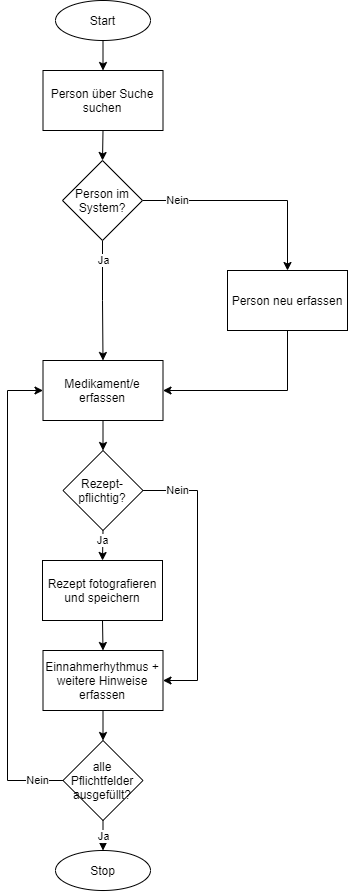
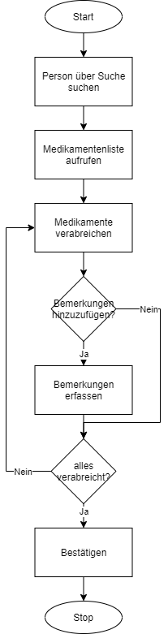

# Projektidee 
### Ausgangslage
Mitarbeitende im Gesundheitsbereich müssen sich sehr viele Sachen merken und sich die Informationen von verschiedenen Orten beschaffen.
Dies bringt eine hohe und gefährliche Fehlerquelle mit sich. 
### Funktion/Projektidee
Mit meinem Projekt will ich dies erleichtern. Die Patientendaten können mit den wichtigsten Informationen erfasst werden
und zu jedem Zeitpunkt abgerufen werden, um zu wissen, was bei welchem Patient verarbeicht werden muss.
### Workflow
#### Dateieingabe
Die Patientendaten (Name, Alter, usw.) werden erfasst. Zusätzlich werden die verschriebenen Medikamente und die Tageszeit, zu der sie angewendet werden müssen, erfasst.
#### Dateiverarbeitung/Speicherung
Die Daten werden in zwei JSON Dateien in Form eines Dictionary gespeichert.
#### Datenausgabe
Der Name einer Person kann eingeben werden bzw. die Datenbank kann durchsucht werden. Anschliessend werden alle Medikamentenangaben und sonstige Informationen
zu dieser Person angezeigt. 
Wenn die Medikamente verabreicht wurden, muss dies entsprechend angehackt werden.
Neben dem Anzeigen der Daten kann auch eine Statistik angezeigt werden, um zu überprüfen,
ob alle Medikamente immer verabreicht wurden.
#Diagramme
Neues Medikament zu einer Person hinzufügen 

Person suchen und verabreichte Medikamente bestätigen 
